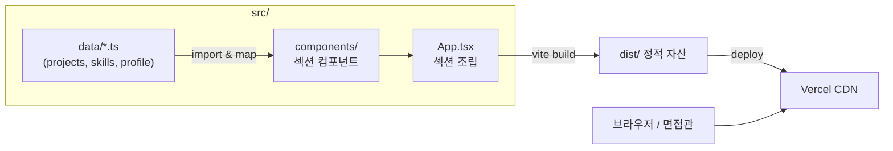

# ARCHITECTURE — Portfolio Hub

프론트엔드 전용 단일 페이지(SPA, 실제로는 한 화면 스크롤) 정적 사이트.
런타임 데이터 소스 없음 — **모든 콘텐츠는 `src/data/`의 타입 안전한 정적 데이터 파일**에서 온다.

## 1. 시스템 개요



핵심: **데이터 → 컴포넌트(map) → 페이지** 의 단방향 흐름. 컴포넌트는 표현만 담당하고 콘텐츠는 데이터가 소유한다. 새 프로젝트 추가 = 데이터 배열에 객체 push, 컴포넌트 불변.

## 2. 폴더 구조

```
jakeV2/
├── public/                 # 파비콘, OG 이미지 등 정적 자산
├── src/
│   ├── data/
│   │   ├── profile.ts      # 이름, 소개 문구, 연락처(email/github)
│   │   ├── skills.ts       # 카테고리별 기술 태그
│   │   └── projects.ts     # ★ 프로젝트 목록 (핵심 확장 지점)
│   ├── types.ts            # Project, SkillCategory 등 공용 타입
│   ├── components/
│   │   ├── layout/
│   │   │   ├── Header.tsx   # 앵커 네비 (스크롤)
│   │   │   └── Footer.tsx
│   │   └── sections/
│   │       ├── Hero.tsx     # 소개 + 연락 CTA
│   │       ├── Skills.tsx   # skills.ts 렌더
│   │       ├── Projects.tsx # projects.ts map + 빈 상태
│   │       ├── ProjectCard.tsx
│   │       └── Contact.tsx  # email / github 링크
│   ├── App.tsx             # 섹션 조립 (Header + main + Footer)
│   ├── main.tsx            # React 엔트리
│   └── index.css           # Tailwind v4 진입 (@import "tailwindcss")
├── index.html
├── vite.config.ts
├── tsconfig.json
├── package.json
├── vercel.json             # SPA/정적 배포 설정 (필요 시)
├── SPEC.md · ARCHITECTURE.md · PLAN.md
└── README.md
```

## 3. 프로젝트 데이터 스키마 (핵심)

`src/types.ts` — ponytail 원칙에 따라 **지금 카드를 그리는 데 실제로 필요한 필드만**.

```ts
/** 프로젝트 유형 태그 (포폴 워크스페이스 다양성 태그와 동일 체계) */
export type ProjectType =
  | 'CRUD'
  | '실시간'
  | '데이터/알고리즘'
  | '외부API'
  | '인증/보안';

/** 카드 표시 상태. 데이터가 채워지기 전에는 'coming-soon' */
export type ProjectStatus = 'completed' | 'in-progress' | 'coming-soon';

export interface Project {
  slug: string;            // 안정적 key (예: 'url-shortener')
  title: string;
  description: string;     // 카드용 1~2문장 요약
  types: ProjectType[];    // 유형 배지 (다양성 근거를 시각적으로 보여줌)
  stack: string[];         // 기술 스택 태그 (예: ['NestJS','Prisma','Neon'])
  status: ProjectStatus;
  liveUrl?: string;        // 라이브 데모 (있을 때만)
  repoUrl?: string;        // GitHub 레포 (있을 때만)
}
```

**Skills / Profile 타입** (동일 파일):

```ts
export interface SkillCategory {
  label: 'Frontend' | 'Backend' | 'Data · Deploy';
  items: string[];
}

export interface Profile {
  name: string;
  tagline: string;         // 한 줄 소개
  intro: string;           // 문단형 자기소개
  email: string;
  github: string;          // URL
}
```

### 3.1 확장 방식 (핵심 설계 요구사항)

새 프로젝트가 완성되면 **`src/data/projects.ts` 배열에 객체 하나만 추가**한다. 컴포넌트·타입 수정 불필요.

```ts
// src/data/projects.ts
export const projects: Project[] = [
  // 지금은 비어 있거나 coming-soon 플레이스홀더 1~2개.
  // 향후:
  // {
  //   slug: 'url-shortener',
  //   title: 'URL Shortener',
  //   description: '단축 URL 발급·리다이렉트·클릭 통계 API.',
  //   types: ['외부API', '데이터/알고리즘'],
  //   stack: ['NestJS', 'Prisma', 'Neon Postgres', 'Redis'],
  //   status: 'completed',
  //   liveUrl: 'https://...',
  //   repoUrl: 'https://github.com/jakesoneyo/...',
  // },
];
```

- `Projects.tsx` 는 `projects.filter/map` 만 수행 → 항목 수에 자동 대응.
- **빈 상태 처리:** `projects` 가 비었거나 전부 `coming-soon` 이면 "포트폴리오 프로젝트 준비 중" 안내 UI를 렌더 (성공 기준 3번).
- `liveUrl`/`repoUrl` 은 optional → 있을 때만 버튼 렌더 (조건부).
- `types` 배지로 프로젝트 다양성을 시각적으로 노출 → 면접 어필.

향후 경력 섹션은 같은 패턴으로 `src/data/experience.ts` + `Experience.tsx` 추가 (현재 미구현).

## 4. 컴포넌트 구성

| 컴포넌트 | 책임 | 데이터 소스 |
|---|---|---|
| `App` | 섹션 순서 조립, 스크롤 컨테이너 | — |
| `Header` | 앵커 네비게이션(#skills, #projects, #contact) | `profile` |
| `Hero` | 이름·tagline·intro·연락 CTA | `profile` |
| `Skills` | 3개 카테고리 카드 + 태그 pill | `skills` |
| `Projects` | 카드 그리드 + 빈 상태 | `projects` |
| `ProjectCard` | 단일 카드(제목·설명·타입 배지·스택·링크) | props: `Project` |
| `Contact` | email(mailto)·github 링크 | `profile` |
| `Footer` | 저작권, GitHub | `profile` |

- 상태 관리 라이브러리(Zustand/TanStack Query) **불필요** — 서버 상태·클라 상태 없음. 순수 정적 렌더. (ponytail)
- 라우팅 불필요 — 단일 페이지 앵커 스크롤.

## 5. 기술 선택 근거

| 결정 | 근거 |
|---|---|
| Vite + React + TS | 워크스페이스 표준 프론트 스택. 빠른 빌드·HMR. |
| Tailwind v4 | 표준. 유틸리티로 반응형·다크대비 빠르게. 별도 CSS 파일 최소화. |
| 데이터 파일 주도 (`src/data/*.ts`) | **핵심 요구사항.** CMS·백엔드 없이 타입 안전하게 콘텐츠 확장. TS 컴파일러가 스키마 강제 → 잘못된 항목 추가 방지. |
| 상태 라이브러리 미도입 | 동적 상태 없음. 과설계 회피(ponytail). |
| 라우터 미도입 | 단일 스크롤 페이지로 충분. |
| Vercel 배포 | 워크스페이스 규약(프론트 SPA는 항상 Vercel). 정적 호스팅 + CDN. |

## 6. 접근성 · 반응형 원칙

- 시맨틱 랜드마크: `<header> <main> <section> <footer>`, 각 섹션 `aria-labelledby`.
- 스킵 링크("본문 바로가기"), 키보드 포커스 링 유지(Tailwind `focus-visible`).
- 색 대비 WCAG AA 목표, 이미지 `alt`, 링크에 명확한 텍스트.
- 반응형 브레이크포인트: 모바일 1열 → `md` 2열 → `lg` 프로젝트 3열 그리드.
- 외부 링크는 `target="_blank" rel="noopener noreferrer"`.
