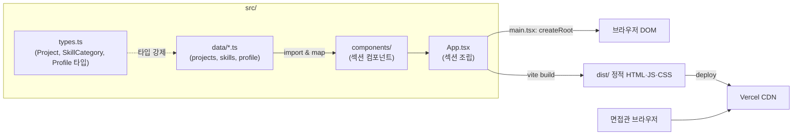

# STUDY — Portfolio Hub (jakeV2)

> 신입 개발자 손영선의 **개인 포트폴리오 허브 랜딩 페이지**를 공부하기 위한 자료.
> 이 문서는 "이 프로젝트를 처음 보는 나"가 면접에서 코드 한 줄 한 줄을 방어할 수 있게 만드는 것이 목표다.
> 백엔드(NestJS)가 주력인 사람 기준으로, **상대적으로 덜 익숙한 프론트엔드(React/TS/Tailwind/Vite)** 를 집중적으로 풀어 쓴다.

---

## 0. 이 문서를 읽는 법

이 프로젝트는 코드 양이 적다(컴포넌트 12개, 데이터 파일 3개, 타입 파일 1개). 하지만 **"적은 코드로 확장 가능한 구조를 만든다"** 는 설계 감각이 핵심이라, 코드 줄 수보다 "왜 이렇게 짰나"가 훨씬 중요하다. 면접관도 이 규모의 랜딩 페이지에서 기술 난이도를 묻지 않는다. 대신 **설계 의도, 타입 안전성, 접근성, 테스트 전략**을 묻는다. 그 관점으로 읽어라.

---

## 1. 프로젝트 요약

### 뭘 만들었나
채용 담당자·면접관이 **한 페이지 스크롤**로 손영선이 어떤 개발자인지, 어떤 스킬과 프로젝트를 가졌는지 파악할 수 있는 정적 랜딩 페이지다. 섹션은 4개다.

1. **Hero** — 이름, 한 줄 소개(tagline), 연락 CTA(프로젝트 보기 / 연락하기), 장식용 데이터 파이프라인 다이어그램
2. **About** — 문단형 자기소개
3. **Skills** — Frontend / Backend / Data·Deploy 3개 카테고리별 기술 태그 (Backend를 ★로 강조)
4. **Projects** — `src/data/projects.ts` 배열을 카드 그리드로 렌더링 (지금은 비어 있어 "준비 중" 빈 상태 표시)
5. **Contact** — 이메일(mailto), GitHub 링크

### 왜 만들었나 (핵심 가치)
이 사이트는 **단순 이력서가 아니라 "포트폴리오 공장의 관문(hub)"** 이다. 손영선은 앞으로 여러 개의 포트폴리오 프로젝트를 계속 찍어낼 계획이고, 프로젝트가 하나 완성될 때마다 이 허브에 카드가 하나씩 늘어나야 한다. 그래서 이 프로젝트의 **진짜 설계 요구사항은 "확장성"** 이다:

> 새 프로젝트가 완성되면 **컴포넌트 코드를 단 한 줄도 고치지 않고**, `src/data/projects.ts` 배열에 객체 하나만 추가하면 카드가 자동으로 하나 늘어난다.

이 "데이터 주도 확장 아키텍처(data-driven architecture)"가 이 프로젝트 전체를 관통하는 주제다. STUDY 전체에서 이 개념을 반복해서 다룬다(→ 4장).

### 기술 개요
- **프론트엔드 전용**: 백엔드/DB/API 없음. 서버에서 받아오는 데이터가 하나도 없다. 모든 콘텐츠는 빌드 시점에 코드 안에 박혀 있는 정적 데이터다.
- **스택**: Vite 8 + React 19 + TypeScript 6 + Tailwind CSS v4
- **테스트**: Vitest 4 + React Testing Library
- **배포**: Vercel (https://jakev2.vercel.app)

---

## 2. 아키텍처

### 2.1 구성도



### 2.2 데이터 흐름 (단방향)

이 프로젝트의 흐름은 **한 방향**이다. 이게 React의 핵심 철학(단방향 데이터 흐름)이기도 하다.

```
데이터(src/data/*.ts)  →  컴포넌트가 import해서 map()  →  화면(JSX)
```

- **데이터가 콘텐츠를 소유한다.** "손영선"이라는 이름, 스킬 목록, 프로젝트 정보는 전부 `src/data/`의 `.ts` 파일에 있다.
- **컴포넌트는 표현(어떻게 보일지)만 담당한다.** 컴포넌트 안에는 "손영선" 같은 실제 값이 하드코딩돼 있지 않다. 대신 데이터를 받아서 그린다.
- 이 분리 덕분에 **콘텐츠를 바꿔도 컴포넌트를 안 건드리고, 디자인을 바꿔도 데이터를 안 건드린다.**

예시로 흐름을 따라가 보자 (Projects 섹션):

1. `src/data/projects.ts`가 `projects` 배열을 export 한다 (현재는 `[]` 빈 배열).
2. `src/components/sections/Projects.tsx`가 `import { projects } from '../../data/projects'` 로 가져온다.
3. `projects.length > 0` 이면 `projects.map((project) => <ProjectCard project={project} />)` 로 카드를 그린다.
4. 비어 있으면 `<EmptyState />`("포트폴리오 프로젝트 준비 중")를 그린다.
5. `App.tsx`가 `<Projects />`를 다른 섹션들과 함께 조립한다.
6. `main.tsx`가 `createRoot(...).render(<App />)` 로 브라우저에 그린다.

### 2.3 폴더 구조와 각 파일 역할

| 경로 | 역할 |
|---|---|
| `src/types.ts` | 모든 데이터의 **모양(스키마)** 을 정의하는 TypeScript 타입. `Project`, `SkillCategory`, `Profile`. |
| `src/data/profile.ts` | 이름·tagline·intro·email·github. Hero/About/Contact/Footer가 공유. |
| `src/data/skills.ts` | 카테고리별 기술 태그 배열. |
| `src/data/projects.ts` | ★ **프로젝트 목록 (핵심 확장 지점).** 지금은 빈 배열. |
| `src/components/layout/Header.tsx` | 상단 고정 앵커 네비게이션(01~04). |
| `src/components/layout/Footer.tsx` | 저작권 + GitHub 링크. |
| `src/components/sections/Hero.tsx` | 최상단 히어로 + 파이프라인 다이어그램. |
| `src/components/sections/About.tsx` | 자기소개 문단. |
| `src/components/sections/Skills.tsx` | skills 데이터를 카테고리 카드로 렌더. |
| `src/components/sections/Projects.tsx` | projects 데이터를 map + 빈 상태 처리. |
| `src/components/sections/ProjectCard.tsx` | 단일 프로젝트 카드(props로 `Project` 받음). |
| `src/components/sections/Contact.tsx` | 이메일·GitHub 링크 카드. |
| `src/components/sections/SectionHead.tsx` | 섹션 공용 헤더(`~/skills` 라벨 + 제목). 재사용. |
| `src/components/sections/Projects.test.tsx` | Vitest + RTL 테스트. |
| `src/App.tsx` | 섹션 순서 조립(Header + main + Footer). |
| `src/main.tsx` | React 진입점. `createRoot`. |
| `src/index.css` | Tailwind v4 진입 + 디자인 토큰(색·폰트) 정의. |

---

## 3. 사용 기술 해설 (신입 눈높이)

백엔드 개발자에게 익숙한 개념부터 연결하면서 설명한다.

### 3.1 React — "UI를 함수로 만든다"

**이게 뭔가?**
React는 화면(UI)을 만드는 JavaScript 라이브러리다. 핵심 아이디어는 **"UI = 함수(데이터)"** 이다. 데이터를 넣으면 화면이 나온다. 데이터가 바뀌면 화면이 알아서 다시 그려진다.

NestJS에 비유하면: NestJS의 컨트롤러가 요청을 받아 응답(JSON)을 만들듯, React 컴포넌트는 데이터(props)를 받아 화면(JSX)을 만든다. "입력 → 출력" 함수라는 점이 똑같다.

**왜 이걸 썼나?**
포폴 워크스페이스 표준 프론트 스택이고, 컴포넌트 단위로 UI를 쪼개 재사용·조립하기 좋기 때문이다. 이 프로젝트에서도 `SectionHead`, `ProjectCard` 같은 조각을 여러 곳에서 재사용한다.

**핵심 개념 1 — 함수형 컴포넌트(Function Component)**
컴포넌트는 그냥 **대문자로 시작하는 함수**다. JSX를 return 한다.

```tsx
// About.tsx — 함수 하나가 곧 컴포넌트 하나
export function About() {
  return (
    <section id="about" ...>
      <p>{profile.intro}</p>
    </section>
  );
}
```
- 함수 이름이 대문자(`About`)여야 React가 "이건 컴포넌트"라고 인식한다. 소문자면 HTML 태그로 취급한다.
- return 안의 `<section>`, `<p>` 처럼 생긴 게 **JSX** — JavaScript 안에 HTML처럼 쓰는 문법이다. 실제로는 함수 호출로 컴파일된다(Vite가 처리).
- `{profile.intro}` 처럼 중괄호 `{}` 안에는 **JavaScript 표현식**을 넣는다. 여기에 변수·함수 호출·삼항연산 등이 들어간다.

**핵심 개념 2 — props (컴포넌트에 넘기는 인자)**
컴포넌트에 데이터를 넘기는 방법이 props다. 함수의 매개변수라고 보면 된다.

```tsx
// Projects.tsx — ProjectCard에게 project 데이터를 props로 넘김
<ProjectCard key={project.slug} project={project} />

// ProjectCard.tsx — project를 매개변수로 받아서 사용
export function ProjectCard({ project }: { project: Project }) {
  return <h3>{project.title}</h3>;
}
```
- `{ project }` 는 구조 분해 할당(destructuring). props 객체에서 `project` 필드만 꺼낸 것.
- `: { project: Project }` 는 TypeScript 타입 표기 — "props는 `project` 필드를 가지고, 그 타입은 `Project`" 라는 뜻.

**핵심 개념 3 — 리스트 렌더링과 key**
배열을 화면 목록으로 바꿀 때 `.map()`을 쓴다.

```tsx
{projects.map((project) => (
  <ProjectCard key={project.slug} project={project} />
))}
```
- 배열의 각 항목을 컴포넌트 하나로 변환한다. 항목 3개면 카드 3개가 생긴다.
- `key`가 **매우 중요하다.** React는 리스트가 바뀔 때 "어떤 항목이 그대로고 어떤 게 바뀌었는지"를 key로 구분해 최소한만 다시 그린다. key가 없거나 중복되면 화면이 꼬이거나 성능이 나빠진다. 여기서는 프로젝트마다 고유한 `slug`("url-shortener" 같은 값)를 key로 썼다 — **배열 인덱스(0,1,2)를 key로 쓰지 않은 것이 포인트**(인덱스 key는 순서가 바뀔 때 버그를 만든다).

**핵심 개념 4 — 조건부 렌더링**
`&&`, 삼항연산자로 "이럴 때만 보여줘"를 표현한다.

```tsx
// Projects.tsx — 프로젝트가 있으면 그리드, 없으면 빈 상태
{hasProjects ? (
  <div className="grid ...">{projects.map(...)}</div>
) : (
  <EmptyState />
)}

// ProjectCard.tsx — liveUrl이 있을 때만 링크 버튼
{project.liveUrl && (
  <a href={project.liveUrl}>라이브 데모</a>
)}
```
- `조건 && <JSX>` : 조건이 참이면 JSX를 그리고, 거짓이면 아무것도 안 그린다.
- `조건 ? A : B` : 참이면 A, 거짓이면 B.

**핵심 개념 5 — 훅(Hooks)은? (정직한 설명, 면접 대비 중요)**
`useState`, `useEffect` 같은 **훅은 이 프로젝트에 하나도 없다.** 왜냐하면 이 사이트는 **상태(state)가 전혀 없는 순수 정적 페이지**이기 때문이다. 사용자가 버튼을 눌러 값이 바뀌거나, 서버에서 데이터를 받아오는 동작이 없다. 모든 값은 빌드 시점에 고정돼 있다.
- **이건 실수가 아니라 의도된 설계다.** 상태가 필요 없는데 `useState`를 넣으면 과설계(over-engineering)다.
- 훅 개념 자체는 알아둬야 한다(→ 5장 로드맵). 면접에서 "왜 useState를 안 썼나?" 물으면 "동적 상태가 없어서"라고 답할 수 있어야 한다.
- 다만 훅이 무엇인지는 알아야 한다: **훅은 함수형 컴포넌트가 "상태를 기억"하거나 "생명주기에 반응"하게 해주는 특수 함수**다. `useState`는 값을 기억하고, 그 값이 바뀌면 컴포넌트를 다시 그린다.

**핵심 개념 6 — StrictMode**
`main.tsx`에서 `<App />`을 `<StrictMode>`로 감쌌다. 개발 모드에서 잠재적 버그(부작용, 안전하지 않은 생명주기)를 잡아주는 개발용 검사 도구다. 프로덕션 빌드에는 영향 없다.

### 3.2 TypeScript — "데이터의 모양을 강제하는 안전장치"

**이게 뭔가?**
JavaScript에 **타입**을 붙인 언어다. 변수·함수·객체가 어떤 모양이어야 하는지 컴파일 단계에서 검사한다. NestJS도 TypeScript라 손영선에게는 가장 익숙한 부분이다.

**이 프로젝트에서 TS의 진짜 역할 — 확장 안전장치**
`src/types.ts`가 이 프로젝트의 심장이다. `Project` 타입이 "프로젝트 데이터가 반드시 가져야 할 모양"을 정의한다.

```ts
export interface Project {
  slug: string;
  title: string;
  description: string;
  types: ProjectType[];   // 정해진 5개 중에서만
  stack: string[];
  status: ProjectStatus;  // 'completed' | 'in-progress' | 'coming-soon'
  liveUrl?: string;       // ? = 있어도 되고 없어도 됨(optional)
  repoUrl?: string;
}
```

나중에 `projects.ts`에 새 프로젝트를 추가할 때, 만약 `title`을 빠뜨리거나 `status`에 오타(`'complete'`)를 내면 **TypeScript 컴파일러가 빌드 전에 에러를 낸다.** 즉 잘못된 데이터가 화면에 나가는 것을 코드 실행 전에 막아준다. 이게 "타입 안전한 데이터 주도 아키텍처"의 핵심 이점이다.

**핵심 개념 — 유니온 타입(Union Type)**
```ts
export type ProjectType = 'CRUD' | '실시간' | '데이터/알고리즘' | '외부API' | '인증/보안';
```
- `|` 는 "이것들 중 하나"라는 뜻. `ProjectType`은 이 5개 문자열 중 하나만 될 수 있다.
- 덕분에 유형 배지에 오타나 엉뚱한 값을 넣을 수 없다.

**핵심 개념 — `Record` 유틸리티 타입**
```ts
// ProjectCard.tsx — 각 status 값마다 한국어 라벨을 대응
const STATUS_LABELS: Record<Project['status'], string> = {
  completed: '완료',
  'in-progress': '진행중',
  'coming-soon': '준비중',
};
```
- `Record<K, V>` = "K 종류의 키마다 V 타입 값을 가진 객체". 여기선 status 3종 각각에 문자열 라벨.
- `Project['status']` = **인덱스 접근 타입** — `Project` 타입에서 `status` 필드의 타입만 꺼낸 것. status 타입이 바뀌면 이 객체도 자동으로 "모든 키를 채워라"고 강제된다. 하나라도 빠뜨리면 컴파일 에러.

**핵심 개념 — `import type`**
```ts
import type { Profile } from '../types';
```
- `import type` 은 "이건 타입일 뿐, 실제 실행 코드가 아니다"라고 명시. 빌드할 때 이 줄은 완전히 사라진다(런타임 비용 0). `tsconfig`의 `verbatimModuleSyntax: true` 설정과 짝을 이룬다.

### 3.3 Tailwind CSS v4 — "클래스 이름으로 스타일링"

**이게 뭔가?**
CSS를 별도 파일에 쓰는 대신, **HTML/JSX 요소에 미리 만들어진 유틸리티 클래스를 붙여** 스타일을 준다. `className="flex flex-col gap-4 rounded-lg border p-6"` 처럼.

**왜 이걸 썼나?**
- 별도 CSS 파일을 거의 안 만들어도 된다(파일 왔다갔다 안 함).
- 반응형·다크대비를 클래스 접두사로 빠르게 처리(`md:grid-cols-2` = 태블릿 이상에서 2열).
- 워크스페이스 표준 스택.

**v3 → v4 달라진 점 (면접 포인트)**
Tailwind v4는 **설정 방식이 크게 바뀌었다.**
- 예전(v3): `tailwind.config.js` 파일 + `@tailwind base;` 같은 지시어.
- 지금(v4): CSS 파일 맨 위에 `@import "tailwindcss";` 한 줄. 그리고 **`@theme {}` 블록 안에 CSS 변수로 디자인 토큰을 정의**한다. 이 프로젝트는 `tailwind.config.js`가 아예 없다.

```css
/* index.css */
@import "tailwindcss";

@theme {
  --color-bg: #0a0c0f;
  --color-accent: #e8a23d;
  --font-mono: "JetBrains Mono", ...;
}
```
- `@theme` 안에 `--color-accent`를 정의하면, JSX에서 `text-accent`, `border-accent`, `bg-accent` 같은 클래스를 **자동으로 쓸 수 있게 된다.** 즉 디자인 토큰(색·폰트)을 한 곳에서 관리하고, 유틸리티 클래스가 그걸 참조한다.
- 이 프로젝트는 **다크 테마 고정**이다(`color-scheme: dark`, 라이트 변형 없음).

**자주 쓰인 유틸리티 클래스 읽는 법**
- `flex flex-col gap-4` : flexbox, 세로 정렬, 자식 간 간격 1rem
- `grid grid-cols-1 md:grid-cols-2 lg:grid-cols-3` : 모바일 1열, `md`(태블릿) 2열, `lg`(데스크톱) 3열 — **반응형의 핵심**
- `rounded-lg border border-line p-6` : 둥근 모서리, 테두리(line 토큰 색), 안쪽 여백
- `text-accent`, `bg-surface` : `@theme`에서 정의한 커스텀 토큰 색
- `sm:` `md:` `lg:` : 브레이크포인트 접두사. 화면이 그 크기 **이상**일 때만 적용.
- `hover:` `focus-visible:` : 마우스 올렸을 때 / 키보드 포커스 때만 적용.

**Vite 플러그인으로 통합**
`@tailwindcss/vite` 플러그인(`vite.config.ts`에 `tailwindcss()`)을 통해 빌드 파이프라인에 붙는다. 별도 PostCSS 설정이 필요 없다.

### 3.4 Vite — "빠른 빌드 도구 겸 개발 서버"

**이게 뭔가?**
프론트엔드 빌드 도구. 두 가지 일을 한다:
1. **개발 서버(`npm run dev`)**: 코드를 저장하면 브라우저가 즉시 갱신된다(HMR, Hot Module Replacement). ESM(브라우저 표준 모듈)을 그대로 서빙해서 매우 빠르다.
2. **프로덕션 빌드(`npm run build`)**: 모든 코드·CSS·폰트를 최적화·압축해 `dist/` 폴더에 정적 파일(HTML/JS/CSS)로 뽑는다. 이걸 Vercel에 올린다.

**빌드 스크립트 뜯어보기**
```json
"build": "tsc -b && vite build"
```
- `tsc -b` : TypeScript 컴파일러로 **타입 검사 먼저**. 타입 에러가 있으면 빌드 자체가 실패한다(타입 안전성이 배포 게이트 역할).
- `&&` : 앞이 성공해야 뒤가 실행. 즉 "타입 통과 → 실제 번들링".
- `vite build` : 실제 번들 생성.

**왜 이걸 썼나?**
Webpack 등 구세대 도구보다 개발 서버 시작·갱신이 훨씬 빠르고, 설정이 간단하다. 포폴 워크스페이스 표준.

### 3.5 Vitest + React Testing Library — "컴포넌트를 테스트한다"

**이게 뭔가?**
- **Vitest**: Vite 기반 테스트 러너. Jest와 API가 거의 같지만 Vite 설정을 그대로 재사용해 빠르다. NestJS에서 Jest를 써봤다면 `describe/it/expect`가 똑같아 친숙하다.
- **React Testing Library(RTL)**: 컴포넌트를 실제 DOM(여기선 jsdom 가상 DOM)에 렌더링하고, **사용자가 보는 방식대로**(텍스트, 역할role) 요소를 찾아 검증한다. "구현 세부사항이 아니라 사용자 경험을 테스트"하는 철학.

**이 프로젝트가 테스트하는 것 — 아키텍처 검증**
`Projects.test.tsx`는 단순 UI 확인이 아니라 **"데이터 주도 아키텍처가 실제로 동작하는가"** 를 검증한다. 이게 영리한 지점이다.

```tsx
it('projects 배열이 비어있으면 빈 상태 안내를 렌더한다', async () => {
  vi.resetModules();
  vi.doMock('../../data/projects', () => ({ projects: [] satisfies Project[] }));
  const { Projects } = await import('./Projects');
  render(<Projects />);
  expect(screen.getByText('포트폴리오 프로젝트 준비 중')).toBeInTheDocument();
  expect(screen.queryByRole('article')).not.toBeInTheDocument();
});
```

- `vi.doMock('../../data/projects', ...)` : **데이터 모듈을 가짜로 갈아끼운다.** 실제 `projects.ts`(빈 배열) 대신, 테스트마다 원하는 값을 주입한다. 두 번째 테스트에서는 샘플 프로젝트 1개를 주입한다.
- `vi.resetModules()` : 모듈 캐시 초기화 — 앞 테스트의 mock이 남지 않게. `await import('./Projects')` 로 mock이 적용된 뒤에 컴포넌트를 새로 불러온다(그래서 `import`가 파일 위가 아니라 테스트 안에 있다).
- 검증: **데이터만 바꿨을 뿐 컴포넌트 코드는 그대로인데**, 빈 배열이면 "준비 중" 안내가 뜨고(카드 `article` 없음), 항목이 있으면 카드가 뜬다. → **"데이터를 추가하면 컴포넌트 수정 없이 카드가 는다"는 설계 요구사항을 코드로 증명한 것.**
- `getByText` vs `queryByText`: `getBy...`는 못 찾으면 에러(존재를 단언), `queryBy...`는 못 찾으면 `null`(부재를 단언할 때 사용).
- `getByRole('article')` : 시맨틱 HTML(`<article>`)을 역할로 찾음. `ProjectCard`가 `<article>`이라 카드 존재 여부를 이렇게 확인한다.

### 3.6 접근성(a11y) — 정적 사이트의 기본기이자 차별점

면접에서 "S 티어 정적 사이트인데 뭘 신경 썼나?"에 대한 좋은 답이 접근성이다. 이 프로젝트는 여러 접근성 장치를 넣었다.

- **시맨틱 랜드마크**: `<header> <main> <section> <footer>` 로 구조를 의미 있게. 각 `<section>`에 `aria-labelledby`로 제목과 연결.
- **스킵 링크**: `App.tsx`의 "본문 바로가기" 링크(`.skip-link`). 평소엔 화면 밖(`left: -9999px`)에 숨겼다가 **키보드 Tab으로 포커스되면 나타난다**(`:focus`). 스크린리더/키보드 사용자가 반복되는 네비를 건너뛰고 본문으로 바로 갈 수 있게.
- **포커스 링**: `a:focus-visible`에 앰버색 outline. 키보드로 어디에 있는지 항상 보인다.
- **`sr-only` 패턴 (Header)**: 모바일에서 네비 라벨("소개")을 시각적으로 숨기고 번호(01)만 보이게 하되(`sr-only sm:not-sr-only`), **스크린리더에는 항상 "01 소개" 전체가 읽힌다.** 화면 공간은 아끼되 접근성은 유지하는 기법.
- **모션 존중**: `@media (prefers-reduced-motion: reduce)` — 사용자가 OS에서 애니메이션 줄이기를 켰으면 점멸 애니메이션·부드러운 스크롤을 끈다.
- **외부 링크 보안**: `target="_blank"`에 항상 `rel="noopener noreferrer"` — 새 탭이 원본 페이지를 조작하는 보안 취약점(tabnabbing) 방지.
- **장식 요소 숨김**: 파이프라인 다이어그램·아이콘 SVG는 `aria-hidden="true"` — 스크린리더가 무의미한 그래픽을 읽지 않게.

### 3.7 self-hosted 웹폰트

`index.css`에서 폰트를 CDN이 아니라 **npm 패키지로 설치해 번들에 포함**한다(`pretendard`, `@fontsource/jetbrains-mono`).
```css
@import "pretendard/dist/web/variable/pretendardvariable-dynamic-subset.css";
@import "@fontsource/jetbrains-mono/400.css";
```
- 장점: 외부 CDN 의존성 제거(CDN이 죽어도 폰트가 뜬다), 개인정보(구글 폰트 요청) 이슈 없음, 오프라인 동작.
- JetBrains Mono(모노스페이스)로 "콘솔/터미널" 무드를, Pretendard(산세리프)로 한글 본문 가독성을 담당한다.

---

## 4. ★ 핵심: 데이터 주도 확장 아키텍처 (왜 카드가 자동으로 늘어나는가)

이 프로젝트에서 면접관이 가장 궁금해할, 그리고 가장 잘 설명해야 할 부분이다. 별도 장으로 깊게 다룬다.

### 4.1 문제: 순진하게 짜면 어떻게 되나

만약 데이터 주도로 안 짜고, 카드를 컴포넌트에 직접 하드코딩했다면:

```tsx
// ❌ 나쁜 방식 (이 프로젝트는 이렇게 안 함)
function Projects() {
  return (
    <div className="grid">
      <article>...URL Shortener 카드 내용 직접...</article>
      <article>...Chat App 카드 내용 직접...</article>
      {/* 프로젝트 추가할 때마다 여기 JSX를 복붙해서 늘려야 함 */}
    </div>
  );
}
```
- 프로젝트가 하나 늘 때마다 **컴포넌트 JSX를 복붙**해야 한다.
- 카드 디자인을 바꾸려면 **모든 카드를 일일이** 고쳐야 한다.
- 오타·누락을 막아줄 장치가 없다.

### 4.2 해결: 데이터와 표현의 분리

이 프로젝트는 **"무엇을 보여줄지(데이터)"와 "어떻게 보여줄지(컴포넌트)"를 완전히 분리**했다.

**(1) 데이터는 배열 한 곳에** — `src/data/projects.ts`
```ts
export const projects: Project[] = [];  // 지금은 비어 있음
```

**(2) 컴포넌트는 그 배열을 map만** — `src/components/sections/Projects.tsx`
```tsx
const hasProjects = projects.length > 0;
// ...
{hasProjects ? (
  <div className="grid ...">
    {projects.map((project) => (
      <ProjectCard key={project.slug} project={project} />
    ))}
  </div>
) : (
  <EmptyState />
)}
```

**(3) 카드 한 장의 모양은 ProjectCard 한 곳에만** — `ProjectCard.tsx`
- 카드 디자인을 바꾸려면 이 파일 하나만 고치면 **모든 카드**가 동시에 바뀐다.

**(4) 타입이 데이터 형태를 강제** — `types.ts`의 `Project`
- 새 항목이 스키마를 안 지키면 컴파일 에러.

### 4.3 그래서 새 프로젝트 추가는?

미래에 URL Shortener를 완성했다고 하자. **딱 이것만** 하면 된다:

```ts
// src/data/projects.ts — 배열에 객체 하나 push
export const projects: Project[] = [
  {
    slug: 'url-shortener',
    title: 'URL Shortener',
    description: '단축 URL 발급·리다이렉트·클릭 통계 API.',
    types: ['외부API', '데이터/알고리즘'],
    stack: ['NestJS', 'Prisma', 'Neon Postgres', 'Redis'],
    status: 'completed',
    liveUrl: 'https://...',
    repoUrl: 'https://github.com/jakesoneyo/...',
  },
];
```

그러면:
- `Projects.tsx`의 `projects.map`이 **자동으로** 카드 1개를 더 그린다. (컴포넌트 코드 수정 0줄)
- `EmptyState`는 배열이 더 이상 비어 있지 않으므로 사라진다.
- `liveUrl`/`repoUrl`이 있으니 카드에 "라이브 데모"/"GitHub" 버튼이 조건부로 나타난다.
- `types`가 배지로, `stack`이 pill로 자동 렌더된다.
- 만약 오타를 냈다면(예: `status: 'done'`) TypeScript가 빌드 전에 잡는다.

이 흐름이 **SPEC의 성공 기준("데이터 배열에 항목 1개를 추가하면 컴포넌트 코드 변경 없이 카드가 1개 늘어난다")** 이자 `Projects.test.tsx`가 자동 검증하는 바로 그 동작이다.

### 4.4 같은 패턴이 곳곳에 반복된다

이 "데이터를 map으로 렌더" 패턴은 프로젝트 전체의 일관된 습관이다:
- **Skills**: `skills.map(category => ...category.items.map(item => <span>))` — 이중 map. 스킬을 추가하면 pill이 자동으로 는다.
- **Header 네비**: `NAV_ITEMS.map(...)` — 섹션을 추가하면 네비 항목이 는다.
- **ProjectCard 내부**: `project.types.map`, `project.stack.map` — 배지·pill이 데이터 개수만큼.

즉 **"목록으로 보이는 모든 것은 데이터 배열 + map"** 이라는 규칙을 지켰다. 이게 확장성과 일관성을 동시에 준다.

### 4.5 향후 확장 (같은 패턴)

경력 섹션을 추가한다면? 새 컴포넌트를 발명하는 게 아니라 **같은 레시피**를 따른다:
1. `types.ts`에 `Experience` 타입 추가
2. `src/data/experience.ts`에 데이터 배열
3. `Experience.tsx`에서 map 렌더
4. `App.tsx`에 `<Experience />` 한 줄 추가

이 **재현 가능한 레시피**가 있다는 것 자체가 이 프로젝트의 설계 가치다.

---

## 5. 학습 로드맵 (체크리스트)

이 프로젝트로 반드시 소화하고 넘어가야 할 개념들. 면접 전 스스로 체크하라.

### React 기초
- [ ] 함수형 컴포넌트가 무엇이고 왜 대문자로 시작하는가
- [ ] JSX 문법과 `{}` 안에 들어가는 것(표현식)
- [ ] props로 데이터 전달 + 구조 분해 할당 `{ project }`
- [ ] `.map()`으로 리스트 렌더링, **`key`가 왜 필요하고 왜 배열 인덱스를 피하는가**
- [ ] 조건부 렌더링 `&&`, 삼항연산자, 빈 상태 처리
- [ ] 단방향 데이터 흐름(부모 → 자식 props)
- [ ] `StrictMode`가 하는 일
- [ ] (개념만) `useState`/`useEffect` 훅이 무엇이고, **왜 이 프로젝트엔 없는가**

### TypeScript
- [ ] `interface`로 데이터 스키마 정의
- [ ] 유니온 타입 `'A' | 'B' | 'C'`
- [ ] optional 필드 `field?: string`
- [ ] `Record<K, V>` 유틸리티 타입
- [ ] 인덱스 접근 타입 `Project['status']`
- [ ] `import type` 과 `verbatimModuleSyntax`
- [ ] `satisfies` 연산자(테스트에서 `[] satisfies Project[]`)

### Tailwind CSS v4
- [ ] 유틸리티 클래스 방식이 무엇이고 장단점
- [ ] v3 → v4 변화: `tailwind.config.js` 없이 `@import "tailwindcss"` + `@theme` 토큰
- [ ] 반응형 접두사 `sm: md: lg:` 와 모바일 퍼스트
- [ ] `hover: focus-visible:` 상태 변형
- [ ] 커스텀 색 토큰이 `text-accent` 같은 클래스로 이어지는 원리

### 빌드·도구
- [ ] Vite 개발 서버(HMR)와 프로덕션 빌드의 차이
- [ ] `tsc -b && vite build` 에서 타입검사가 빌드 게이트인 이유
- [ ] Vercel 정적 배포 흐름(dist → CDN)

### 테스트
- [ ] Vitest `describe/it/expect` 구조
- [ ] RTL의 철학(사용자 관점, 역할 기반 쿼리)
- [ ] `getBy` vs `queryBy` 차이(존재 단언 vs 부재 단언)
- [ ] `vi.doMock` + `vi.resetModules`로 데이터 모듈 주입
- [ ] 이 테스트가 **아키텍처(데이터→렌더)** 를 검증한다는 점

### 접근성·설계 사고
- [ ] 시맨틱 랜드마크와 `aria-labelledby`
- [ ] 스킵 링크, `sr-only` 패턴
- [ ] `prefers-reduced-motion` 존중
- [ ] `rel="noopener noreferrer"` 가 막는 것(tabnabbing)
- [ ] **데이터 주도 확장 아키텍처를 3문장으로 설명하기** (가장 중요)
- [ ] ponytail(과설계 회피) 원칙 — 상태 라이브러리·라우터를 왜 안 넣었는가

---

## 6. 한 줄 정리

> "콘텐츠(데이터)와 표현(컴포넌트)을 분리하고, TypeScript로 데이터 형태를 강제해서, **새 프로젝트를 데이터 배열에 추가하기만 하면 컴포넌트 수정 없이 카드가 자동으로 느는** 타입 안전한 확장형 랜딩 페이지."

이 문장을 입에서 자연스럽게 나오게 외워라. 이 프로젝트 면접의 8할이 여기서 나온다.
